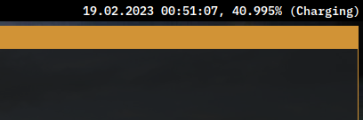

# statxt


Very simple status bar for my desktop usage.

This project is optimized with the goal to create an extremely small binary:
the output with `-Drelease-small` is around 6.2KB with glibc.

Because of this, I'm not making much use of the Zig standard library at all.
I'm mostly choosing to write this in Zig because it's more ergonomic than C,
and actually creates smaller binaries if you only use libc linked dynamically.

This isn't configurable at all; if you want to change how it looks, you have to change the code.
I've done this on purpose because parsing is too hard, considering how simple this code is.

## Building
I use Nix (with flakes enabled) to build this.
```sh
nix build .
```
You can also build this manually. You must have Zig 0.10.0.
```sh
zig build -Drelease-small
```
